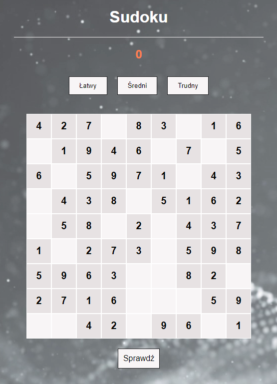
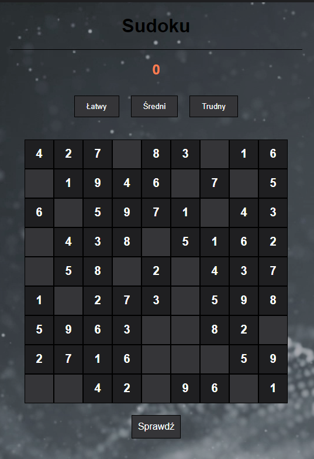
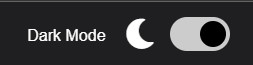
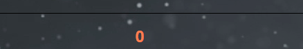

# Sudoku
## Technologies
Project is created with:
* HTML,
* CSS,
* JavaScript,
* Font Awesome,
* LocalStorage,
* CSS Variables,

## Start up
To start this project u need:
1. Download the folder with files from the github repository,
2. Unpack the .zip to your destination,
3. Run the index.html file in any browser (currently the project is configured mainly for Chrome).

It's all what you need to do to enjoy one of the most popular mind game in the world.

## How it work

### Generating Sudoku Board

Generating Solution:
The generateRandomSudoku() function creates a base sudoku board with digits arranged according to the rules of the game. It employs various techniques, such as shuffling digits, to achieve a unique solution. It checks whether the board has only one solution.

Hiding Digits:
Based on the selected difficulty level (easy, medium, hard), the createPlayerBoard() function hides a specific number of digits in the board. The hideNumbers() function is used, randomly hiding digits by setting them to 0.

### Rendering the Board

Rendering on the Page:
The setGame() function iterates through the board squares, creating div elements representing individual sudoku squares. It adds event handling for actions such as clicking on a board square.

Gameplay Handling

Selecting Digits and Squares:
The selectNumber() and selectTile() functions handle selecting digits from the sidebar and placing them on the board by clicking on a square.

Checking the Validity of Entered Digits:
The inputNumber() function checks whether the entered digit is valid (a number from 1 to 9). In the case of an incorrect value, it removes the digit from the board square.

Checking Solution Validity:
The checkSolution() function compares the user-entered board with the correct solution. It informs the user about the correctness or errors in the solution.

### Dark/Light Mode

Users can switch between dark and light modes using a button. User preferences for the mode are stored in localStorage.

## Screens

This is the basic version of sudoku board. The photo shows the easy version of the game.

For those who prefer darkness, there is a dark mode. It's enough that we tire our minds, we don't have to strain our eyes.

A switch in the top corner allows you to easily change the mode.  

One of the most interesting things is the error counter. Thanks to it, after completing the board, we can check whether we have made a mistake anywhere. If there is an error somewhere, we will receive a message about an incorrect solution and the error counter will add an "error point".

## Inspiration

I was inspired to create the game by a YouTube tutorial from Kenny Yip Coding "How to Build Sudoku JavaScript Tutorial" (https://youtu.be/S4uRtTb8U-U?si=RxQxLsh92KmRPA0N). In this guide, the game board was hard-coded, so I updated the JS code that generates the boards randomly. I managed to add a dark and light theme with the help of a long-overhauled "JavaScript Web Projects" course.

## Comments

At last, the application still leaves a lot of room for development, which I will certainly devote more time to in the future.
